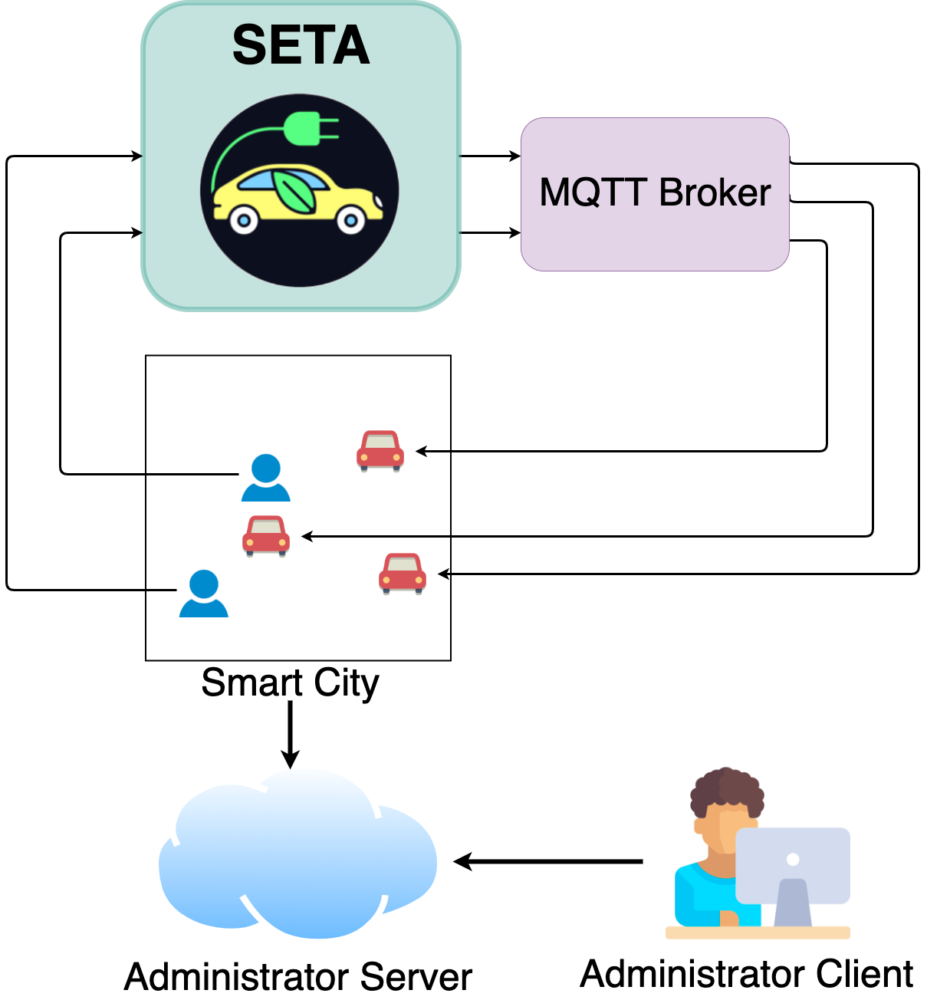
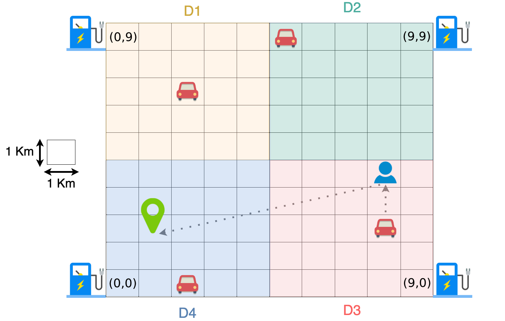

# SETA project - Alberto Rizzi

The goal of the project is to develop SETA (SElf-driving TAxi service), a peer-to-peer system of self-driving taxis for
the citizens of a smart city.

    

The smart city is divided into four districts. The citizens of the smart city use SETA to request a self- driving taxi
that takes them from their current position to a destination point. In SETA, the taxis of the smart city coordinate with
each other to decide which taxi will handle each of such requests.

Each taxi is also equipped with a sensor that periodically detects the air pollution level of the smart city. Moreover,
every ride consumes the battery level of the taxi. When the residual battery level is too low, the taxi must go to the
recharge station of the district in which it is positioned. Periodi- cally, the taxis have to communicate to a remote
server called Administrator Server information about the air pollution levels, the number of completed rides, the number
of kilometers driven, and the remaining battery level. The SETA administrators (Administrator Client) are in charge of
monitoring this information through the Administrator Server.

Furthermore, through the Administrator Server it is also possible to dynamically register and remove taxis from the
system.

    

Project develop in the course of Distributed and Pervasive Computing of M.Sc. Computer Scienze UNIMI.